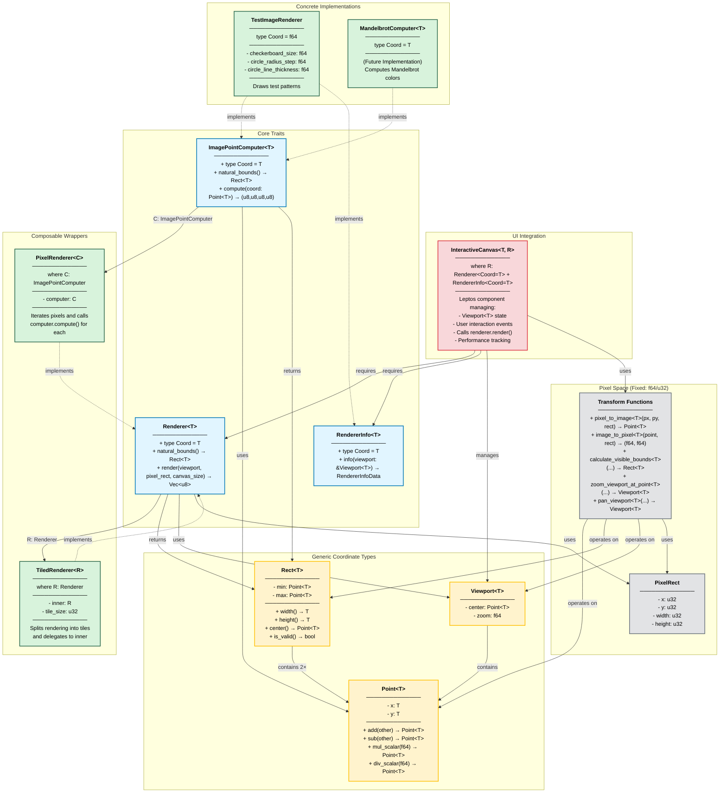

# Pluggable Renderer Architecture

## Overview

Type-safe, composable renderer system with compile-time coordinate space separation and generic precision support.

## Architecture Diagram



## Core Abstractions

### 1. Renderer Trait (`src/rendering/renderer_trait.rs`)

The fundamental abstraction for rendering pixel data.

```rust
pub trait Renderer {
    type Coord;  // Image-space coordinate type (generic)

    fn natural_bounds(&self) -> Rect<Self::Coord>;
    // Returns the native bounds of the rendered image

    fn render(
        &self,
        viewport: &Viewport<Self::Coord>,
        pixel_rect: PixelRect,
        canvas_size: (u32, u32),
    ) -> Vec<u8>;
    // Returns RGBA pixel data (length = width * height * 4)
}
```

**Design Philosophy:**
- Generic over `Coord` type (enables f64, rug::Float, or any numeric type)
- Can be implemented in any way (pixel iteration, GPU, lookup tables, etc.)
- Composable: renderers can wrap other renderers
- Returns raw RGBA bytes for WebGL display

### 2. ImagePointComputer Trait (`src/rendering/point_compute.rs`)

Specialized abstraction for point-by-point color computation.

```rust
pub trait ImagePointComputer {
    type Coord;  // Image-space coordinate type

    fn natural_bounds(&self) -> Rect<Self::Coord>;

    fn compute(&self, coord: Point<Self::Coord>) -> (u8, u8, u8, u8);
    // Pure computation: coordinate → RGBA color
}
```

**Design Philosophy:**
- Pure stateless computation
- No loops or pixel iteration—just computes color for a single point
- Perfect for mathematical fractals, color functions, etc.
- Designed to be wrapped by `PixelRenderer`

### 3. RendererInfo Trait (`src/rendering/renderer_info.rs`)

Optional trait for exposing renderer metadata to the UI.

```rust
pub trait RendererInfo {
    type Coord;

    fn info(&self, viewport: &Viewport<Self::Coord>) -> RendererInfoData;
}

pub struct RendererInfoData {
    pub name: String,
    pub center_display: String,
    pub zoom_display: String,
    pub custom_params: Vec<(String, String)>,
    pub render_time_ms: Option<f64>,
}
```

## Composable Implementations

### PixelRenderer (`src/rendering/pixel_renderer.rs`)

Converts an `ImagePointComputer` into a `Renderer` by adding pixel iteration logic.

```rust
pub struct PixelRenderer<C: ImagePointComputer> {
    computer: C,
}

impl<C> Renderer for PixelRenderer<C>
where
    C: ImagePointComputer,
    C::Coord: Clone + Sub<Output = C::Coord> + Add<Output = C::Coord>
              + Mul<f64, Output = C::Coord> + Div<f64, Output = C::Coord>
{
    type Coord = C::Coord;

    fn render(&self, viewport: &Viewport<Self::Coord>,
              pixel_rect: PixelRect, canvas_size: (u32, u32)) -> Vec<u8> {
        // For each pixel in pixel_rect:
        // 1. Convert pixel coords to image coords
        // 2. Call computer.compute()
        // 3. Write RGBA to output buffer
    }
}
```

### TiledRenderer (`src/rendering/tiled_renderer.rs`)

Adds tiling to **any** `Renderer` implementation.

```rust
pub struct TiledRenderer<R: Renderer> {
    inner: R,
    tile_size: u32,
}

impl<R> Renderer for TiledRenderer<R>
where
    R: Renderer,
    R::Coord: Clone
{
    type Coord = R::Coord;

    fn render(&self, viewport: &Viewport<Self::Coord>,
              pixel_rect: PixelRect, canvas_size: (u32, u32)) -> Vec<u8> {
        // Split pixel_rect into tiles
        // Delegate each tile to inner.render()
        // Assemble tiles into final buffer
    }
}
```

**Benefits:**
- Works with ANY renderer, not just `PixelRenderer`
- Enables parallelization, progress tracking, memory locality
- Composable with other wrappers

## Coordinate Types (`src/rendering/points.rs`)

### Point<T>

Generic 2D point in image space.

```rust
pub struct Point<T> {
    x: T,
    y: T,
}
```

**Operations:**
- `add(&self, other) -> Point<T>` where `T: Add<Output=T> + Clone`
- `sub(&self, other) -> Point<T>` where `T: Sub<Output=T> + Clone`
- `mul_scalar(&self, scalar: f64) -> Point<T>` where `T: Mul<f64, Output=T> + Clone`
- `div_scalar(&self, scalar: f64) -> Point<T>` where `T: Div<f64, Output=T> + Clone`

### Rect<T>

Generic rectangular region in image space.

```rust
pub struct Rect<T> {
    pub min: Point<T>,
    pub max: Point<T>,
}
```

**Methods:**
- `width() -> T` where `T: Sub<Output=T> + Clone`
- `height() -> T` where `T: Sub<Output=T> + Clone`
- `center() -> Point<T>` where `T: Clone + Add + Div + From<f64>`
- `is_valid() -> bool` where `T: PartialOrd + Clone`

### Viewport<T>

Describes what portion of the image is visible.

```rust
pub struct Viewport<T> {
    pub center: Point<T>,      // Center point in image space
    pub zoom: f64,             // Magnification (1.0 = show full natural_bounds)
}
```

- `zoom = 1.0` displays entire natural_bounds
- `zoom = 2.0` displays half the area (2x magnification)

## Coordinate Transformations (`src/rendering/transforms.rs`)

All transformation functions are generic over `T` and require `natural_bounds` as context.

### Core Transformations

**calculate_visible_bounds<T>(viewport, natural_bounds, canvas_w, canvas_h) -> Rect<T>**
- Converts `Viewport<T>` to visible `Rect<T>`
- Handles aspect ratio by extending wider dimension
- Ensures natural_bounds fits in constraint dimension at zoom 1.0

**pixel_to_image<T>(pixel_x: f64, pixel_y: f64, target_rect: &Rect<T>, ...) -> Point<T>**
- Maps pixel coordinates (f64) to image coordinates (T)
- Core function used in `PixelRenderer.render()`

**image_to_pixel<T>(image: &Point<T>, target_rect: &Rect<T>, ...) -> (f64, f64)**
- Inverse mapping for UI purposes

### Viewport Navigation

**pan_viewport<T>(viewport, offset_x: T, offset_y: T) -> Viewport<T>**
- Translates viewport center in image space

**zoom_viewport_at_point<T>(viewport, natural_bounds, zoom_factor, pixel_x, pixel_y, ...) -> Viewport<T>**
- Zooms keeping a specific pixel position fixed under the cursor

**apply_pixel_transform_to_viewport<T>(viewport, natural_bounds, transform, ...) -> Viewport<T>**
- Converts pixel-space gestures (drag+zoom) to viewport changes

## Type Safety Guarantees

1. **Cannot mix coordinate spaces** - Pixel space (u32/f64) and image space (generic T) are distinct
2. **Cannot convert without context** - Transformations require viewport + canvas dimensions + natural_bounds
3. **Cannot mix precision types** - f64 and rug::Float renderers use different `Coord` types
4. **Generic constraints enforced** - Compiler ensures T supports required operations

## Generic Constraint Requirements

The system requires that generic type `T` supports:

```rust
T: Clone
   + std::ops::Add<Output = T>           // a + b
   + std::ops::Sub<Output = T>           // a - b
   + std::ops::Mul<f64, Output = T>      // a * scalar
   + std::ops::Div<f64, Output = T>      // a / scalar
```

Additional constraints for specific operations:
- `From<f64>` - for creating specific values
- `PartialOrd` - for rect validation

This means **any numeric type** supporting these operations works:
- `f64` (64-bit floating point)
- `rug::Float` (arbitrary precision)
- Custom types with operator overloads

## UI Integration (`src/components/interactive_canvas.rs`)

The `InteractiveCanvas` component is generic over both coordinate type `T` and renderer type `R`.

```rust
pub fn InteractiveCanvas<T, R>(renderer: R) -> CanvasWithInfo
where
    T: Clone + Add<Output=T> + Sub<Output=T> + Div<Output=T>
       + Div<f64, Output=T> + Mul<f64, Output=T> + From<f64> + 'static,
    R: Renderer<Coord = T> + RendererInfo<Coord = T> + Clone + 'static,
```

**Responsibilities:**
1. Manages canvas element and lifecycle
2. Maintains `Viewport<T>` state via Leptos signals
3. Listens to user interaction events (pointer, wheel)
4. Converts pixel-space gestures to viewport changes
5. Calls `renderer.render()` on each viewport update
6. Measures and displays render performance metrics
7. Handles window resize events

## Pixel Space vs. Image Space

| Aspect | Pixel Space | Image Space |
|--------|------------|-------------|
| **Type** | `u32` (always) | Generic `T` (f64, rug::Float, etc.) |
| **Use** | Screen coordinates, canvas dimensions | Mathematical coordinates, viewport bounds |
| **Precision** | 32-bit (sufficient for pixels) | Arbitrary (can zoom to 10^100+) |
| **Functions** | `PixelRect`, `pixel_to_image()` | `Point<T>`, `Rect<T>`, `Viewport<T>` |
| **Transformations** | User gestures (mouse pixels) | Zoom/pan calculations |

## Adding New Renderers

### Option 1: Implement ImagePointComputer (for point-based algorithms)

```rust
#[derive(Clone)]
pub struct MyRenderer {
    // parameters...
}

impl ImagePointComputer for MyRenderer {
    type Coord = f64;  // or rug::Float

    fn natural_bounds(&self) -> Rect<f64> {
        Rect::new(Point::new(-2.0, -2.0), Point::new(2.0, 2.0))
    }

    fn compute(&self, coord: Point<f64>) -> (u8, u8, u8, u8) {
        // Compute color for this point
        (r, g, b, 255)
    }
}

// Usage:
let renderer = PixelRenderer::new(MyRenderer::new());
let canvas = InteractiveCanvas(renderer);
```

### Option 2: Implement Renderer directly (for custom rendering strategies)

```rust
#[derive(Clone)]
pub struct MyCustomRenderer {
    // parameters...
}

impl Renderer for MyCustomRenderer {
    type Coord = f64;

    fn natural_bounds(&self) -> Rect<f64> {
        // ...
    }

    fn render(&self, viewport: &Viewport<f64>,
              pixel_rect: PixelRect, canvas_size: (u32, u32)) -> Vec<u8> {
        // Custom rendering logic (GPU, caching, etc.)
    }
}
```

### Option 3: Compose existing renderers

```rust
// Add tiling to any renderer:
let renderer = TiledRenderer::new(PixelRenderer::new(MyComputer::new()), 128);

// Stack multiple wrappers:
let renderer = CachedRenderer::new(
    TiledRenderer::new(
        PixelRenderer::new(MyComputer::new()),
        128
    )
);
```

## Key Architectural Patterns

| Pattern | Implementation | Benefit |
|---------|----------------|---------|
| **Trait Composition** | Renderers can wrap renderers | Flexible stacking of functionality |
| **Generic-First Design** | All coordinates parameterized by `T` | Arbitrary precision with no code changes |
| **Separation of Concerns** | Point computation vs. pixel iteration vs. tiling vs. UI | Easy to extend with new algorithms |
| **Type Safety** | Generic constraints enforce valid operations | Compiler catches precision mismatches |
| **Pluggability** | `Renderer` trait is open for implementation | New rendering algorithms don't affect UI |
| **Composition Over Inheritance** | Stack wrappers like `PixelRenderer` + `TiledRenderer` | More flexible than class hierarchies |

## Type Flow Example

```
PixelRenderer<TestImageRenderer>
├─ Generic Parameter: C = TestImageRenderer
├─ C::Coord = f64
│
├─ PixelRenderer::Coord = C::Coord = f64
│
├─ InteractiveCanvas<f64, PixelRenderer<TestImageRenderer>>
│  ├─ T = f64
│  ├─ R = PixelRenderer<TestImageRenderer>
│  ├─ Viewport<f64> with center: Point<f64>, zoom: f64
│  └─ All transform functions parameterized by f64
│
└─ For Extreme Precision (future):
   Replace f64 with rug::Float everywhere:
   ├─ C::Coord = rug::Float
   ├─ PixelRenderer<MyMandelbrot>::Coord = rug::Float
   ├─ InteractiveCanvas<rug::Float, PixelRenderer<MyMandelbrot>>
   └─ All transform functions work identically with rug::Float
```

## Key Files and Their Roles

| File | Purpose |
|------|---------|
| `src/rendering/renderer_trait.rs` | Core `Renderer<T>` trait |
| `src/rendering/point_compute.rs` | `ImagePointComputer<T>` trait |
| `src/rendering/pixel_renderer.rs` | Wraps `ImagePointComputer` → `Renderer` |
| `src/rendering/tiled_renderer.rs` | Wraps any `Renderer` with tiling |
| `src/rendering/renderer_info.rs` | `RendererInfo<T>` trait for UI |
| `src/rendering/points.rs` | Generic `Point<T>` and `Rect<T>` types |
| `src/rendering/viewport.rs` | `Viewport<T>` state container |
| `src/rendering/transforms.rs` | Generic coordinate transformation functions |
| `src/rendering/pixel_rect.rs` | `PixelRect` (pixel-space only) |
| `src/rendering/canvas_utils.rs` | WebGL integration |
| `src/components/interactive_canvas.rs` | Leptos component binding UI to `Renderer<T>` |
| `src/components/test_image.rs` | Example: `TestImageRenderer` |

## Future Extensions

- **Parallel rendering**: `TiledRenderer` can dispatch tiles to thread pool
- **Progressive rendering**: Wrapper manages tile queue and priority
- **Caching**: `CachedRenderer` wrapper stores previously rendered tiles
- **GPU acceleration**: Implement `Renderer` with WebGPU compute shaders
- **Arbitrary precision**: Replace `f64` with `rug::Float` for extreme zoom levels
- **URL persistence**: Serialize viewport to URL params for sharing
- **Multiple viewports**: Compose multiple `InteractiveCanvas` instances
