# Design Document - Extreme Zoom Mandelbrot Explorer

## Description

A high-performance, browser-based Mandelbrot set explorer capable of rendering at extreme zoom levels (up to 10^100 and
beyond) with interactive real-time exploration. The application is built entirely in Rust, compiled to WebAssembly,
using Leptos for the frontend framework and advanced mathematical techniques including perturbation theory and arbitrary
precision arithmetic.

## Scope

**Modules and Components:**

- `fractal-core`: Mandelbrot computation engine (arbitrary precision math, perturbation theory)
- `fractal-render`: Tile-based rendering orchestration and coloring algorithms
- `fractal-ui`: Leptos-based user interface and interaction handling
- `fractal-state`: Viewport state management and persistence
- `fractal-export`: PNG image export with embedded metadata

**Out of Scope for v1:**

- GPU acceleration (WebGPU support deferred to v2)
- Backend/distributed rendering
- Custom color scheme editor
- Animation and zoom sequences

## Tech Stack

- **Language**: Rust 1.80+ (100% Rust, no TypeScript/JavaScript)
- **Frontend Framework**: Leptos 0.6+ (compiled to WebAssembly)
- **WASM Tooling**: wasm-bindgen, wasm-pack
- **Build Tool**: Trunk (for bundling and dev server)
- **Arbitrary Precision**: rug 1.24+ (GMP wrapper for arbitrary precision floats)
- **Parallelism**: rayon 1.10+ with wasm-bindgen-rayon (multi-core via Web Workers + SharedArrayBuffer)
- **Package Manager**: Cargo
- **Testing**: proptest (property-based), rstest (fixtures), wasm-bindgen-test (browser tests)
- **Image Export**: png crate 0.17+ (with tEXt chunk metadata)
- **Serialization**: serde 1.0+ with serde_json, base64 0.22+
- **Web APIs**: web-sys, wasm-bindgen for DOM/Canvas/Storage access

**Required HTTP Headers (for SharedArrayBuffer/rayon threading):**

```txt
Cross-Origin-Opener-Policy: same-origin
Cross-Origin-Embedder-Policy: require-corp
```

---

## Architecture

### Components


### Core Components

#### 1. fractal-core (Computation Engine)

- **Purpose**: Mandelbrot set computation using perturbation theory with arbitrary precision arithmetic
- **Key features**:
  - Reference orbit calculation using `rug::Float` (arbitrary precision)
  - Delta orbit computation using f64 (perturbation theory)
  - Automatic precision scaling based on zoom level: `precision_bits = (decimal_places × 3.322).ceil()`
  - Parallel computation across CPU cores via rayon
  - Separation of computation (iteration data) from visualization (coloring)
- **State**:
  - Current reference orbit (array of complex `rug::Float` values)
  - Zoom level (determines precision requirements)
  - Maximum iteration count (scaled by zoom)

#### 2. fractal-render (Rendering Orchestrator)

- **Purpose**: Manages tile-based progressive rendering and coordinates computation with display
- **Key features**:
  - Adaptive tile sizing based on zoom level
  - Spiral rendering pattern (center outward)
  - Render cancellation on user interaction
  - Progress tracking and reporting
  - Tile priority queue management
- **State**:
  - Active render job (can be cancelled)
  - Completed tiles (cached for fast preview)
  - Render progress (completed/total tiles)
  - Active compute threads/workers count

#### 3. Color Algorithms (6 implementations)

- **Purpose**: Convert iteration data to visual RGB output
- **Implementations**:
  1. **Smooth iteration**: Continuous coloring using mu (smoothed iteration count)
  2. **Escape time**: Basic iteration count to color mapping
  3. **Distance estimation**: Edge detection using derivative magnitude
  4. **Orbit trap**: Distance measurement to geometric trap shapes
  5. **Potential-based**: Logarithmic potential from escape radius
  6. **Field lines**: Angle-based coloring from final z argument
- **State**:
  - Active color scheme selection
  - Per-scheme settings (offset, scale, palette cycling speed)

#### 4. fractal-ui (User Interface)

- **Purpose**: Leptos-based reactive UI with canvas rendering and interaction handling
- **Key features**:
  - Full-screen canvas rendering
  - Auto-hiding bottom UI panel (fades in on mouse movement, fades out after 4 seconds)
  - Mouse/touch interaction handling (pan, zoom, resize)
  - Real-time preview using imageData transformation (pixel-space operations)
  - Interaction debouncing (1.5 second delay before render starts)
- **State**:
  - UI visibility (visible/hidden)
  - Canvas dimensions
  - Mouse/touch interaction state
  - Current imageData (for fast preview)

#### 5. fractal-state (State Management)

- **Purpose**: Manages viewport parameters and persistence
- **Key features**:
  - Viewport state (center coordinates, zoom level)
  - Render settings (base iterations, scaling factor)
  - Color scheme configuration
  - URL synchronization (Base64-encoded JSON)
  - localStorage persistence
  - State precedence: URL params → localStorage → defaults
- **State**:
  - Center coordinates (`rug::Float` serialized as decimal strings)
  - Zoom level (f64, stored as decimal string for precision)
  - Base iteration count, iteration scaling factor
  - Active color scheme and settings

#### 6. fractal-export (Image Export)

- **Purpose**: Export rendered fractals as PNG with embedded metadata
- **Key features**:
  - PNG export at current canvas resolution
  - Metadata embedding via PNG tEXt chunks (center, zoom, iterations, color scheme)
  - User-specified filename
- **State**:
  - Current canvas imageData
  - Fractal parameters for metadata

### Interfaces

#### 1. Viewport Parameters

```rust
#[derive(Debug, Clone, Serialize, Deserialize)]
struct ViewportParams {
    /// Center coordinate (real part) as decimal string for arbitrary precision
    center_real: String,
    /// Center coordinate (imaginary part) as decimal string for arbitrary precision  
    center_imag: String,
    /// Zoom level as decimal string (can be 10^100+)
    zoom: String,
    /// Canvas width in pixels
    width: u32,
    /// Canvas height in pixels
    height: u32,
}
```

#### 2. Render Parameters

```rust
#[derive(Debug, Clone)]
struct RenderParams {
    /// Viewport definition
    viewport: ViewportParams,
    /// Base iteration count
    base_iterations: u32,
    /// Iteration scaling factor for zoom
    iteration_scaling: f64,
    /// Active color scheme
    color_scheme: ColorScheme,
    /// Color scheme settings
    color_settings: ColorSettings,
}
```

#### 3. Pixel Computation Data

```rust
/// Per-pixel data output from computation engine
#[derive(Debug, Clone, Copy)]
struct PixelData {
    /// Iteration count before escape (or max iterations)
    iterations: u32,
    /// Whether point escaped (true) or is in set (false)
    escaped: bool,
    /// Final z value magnitude
    z_magnitude: f32,
    /// Smoothed iteration value (mu) for continuous coloring
    mu: f32,
    /// Derivative magnitude for distance estimation
    derivative_magnitude: f32,
}
```

#### 4. Tile Definition

```rust
#[derive(Debug, Clone)]
struct Tile {
    /// Tile position in pixel space
    x: u32,
    y: u32,
    /// Tile dimensions
    width: u32,
    height: u32,
    /// Priority (0 = highest, center tiles rendered first)
    priority: u32,
    /// Computation data for each pixel
    data: Vec<PixelData>,
}
```

#### 5. Computation Engine Trait (for GPU abstraction in v2)

```rust
trait ComputeEngine {
    /// Compute pixel data for a tile
    fn compute_tile(&self, params: &RenderParams, tile: &TileSpec) -> Result<Vec<PixelData>>;
    
    /// Compute reference orbit (high precision)
    fn compute_reference_orbit(&self, center: &Complex<rug::Float>, max_iter: u32) -> Vec<Complex<rug::Float>>;
}

/// v1 implementation
struct CpuEngine {
    thread_pool: rayon::ThreadPool,
}

/// v2 implementation (future)
struct GpuEngine {
    device: wgpu::Device,
    queue: wgpu::Queue,
}
```

### Persistence Model


**Persistence Flow:**

1. **On state change**: Update URL query parameters (Base64-encoded JSON)
2. **On render completion**: Save to localStorage
3. **On page load**:
   - Parse URL params → use if valid
   - Else load from localStorage → use if valid
   - Else use default values

**Default Values:**

- Center: -0.5 + 0i (shows complete Mandelbrot set)
- Zoom: 1.0
- Viewport: real [-2, 1], imaginary [-1.5, 1.5]
- Base iterations: 500
- Iteration scaling factor: 1.0
- Color scheme: Smooth iteration

## Data Flow

### Render Initialization Sequence

```mermaid
sequenceDiagram
    participant User
    participant UI as fractal-ui
    participant State as fractal-state
    participant Render as fractal-render
    participant Core as fractal-core
    participant Canvas

    User->>UI: Page load
    UI->>State: Load state (URL → localStorage → defaults)
    State-->>UI: ViewportParams
    UI->>Render: Start render(params)
    Render->>Core: Compute reference orbit (rug::Float)
    Core-->>Render: Reference orbit array
    Render->>Render: Generate tile list (spiral pattern)
    loop For each tile (parallel via rayon)
        Render->>Core: Compute tile (f64 delta orbits)
        Core-->>Render: PixelData array
        Render->>Render: Apply color scheme
        Render->>Canvas: Draw tile
        Canvas-->>User: Progressive visual update
    end
    Render-->>UI: Render complete (time elapsed)
    UI->>State: Update URL + localStorage
```



### User Interaction Sequence

```mermaid
sequenceDiagram
    participant User
    participant UI as fractal-ui
    participant State as fractal-state
    participant Render as fractal-render
    participant Canvas

    User->>UI: Mouse drag start
    UI->>Render: Cancel active render
    Render-->>UI: Cancelled
    UI->>UI: Store initial mouse position
    
    loop While dragging
        User->>UI: Mouse move
        UI->>Canvas: Transform imageData (pixel offset)
        Canvas-->>User: Fast preview
    end
    
    User->>UI: Mouse release
    UI->>UI: Start 1.5s debounce timer
    
    Note over UI: No interaction for 1.5s
    
    UI->>State: Calculate new center (pixel → fractal)
    State->>State: Update viewport params
    State->>Render: Start render (new params)
```



### Zoom Operation Sequence


## Logic

### Perturbation Theory Algorithm

```mermaid
flowchart TD
    Start([Start Render]) --> CalcPrec[Calculate precision bits<br/>from zoom level]
    CalcPrec --> RefOrbit[Compute Reference Orbit<br/>Z_n+1 = Z_n² + C<br/>using rug::Float]
    RefOrbit --> GenTiles[Generate tile list<br/>spiral from center]
    GenTiles --> ParLoop{Parallel loop<br/>each tile via rayon}
    
    ParLoop --> TileCalc[For each pixel in tile]
    TileCalc --> InitDelta[Initialize δ₀ = c - C]
    InitDelta --> DeltaLoop{Iterate<br/>n < max_iter}
    
    DeltaLoop --> CalcDelta[δ_n+1 = 2×Z_n×δ_n + δ_n² + δ₀<br/>using f64]
    CalcDelta --> CheckEscape{|Z_n + δ_n| > 4?}
    
    CheckEscape -->|Yes| CalcMu[Calculate smoothed μ]
    CalcMu --> StorePx[Store PixelData]
    
    CheckEscape -->|No| IncIter[n++]
    IncIter --> DeltaLoop
    
    DeltaLoop -->|Max iter| InSet[Mark as in-set]
    InSet --> StorePx
    
    StorePx --> ApplyColor[Apply color scheme]
    ApplyColor --> DrawTile[Draw tile to canvas]
    DrawTile --> UpdateProg[Update progress]
    
    UpdateProg --> ParLoop
    ParLoop -->|All tiles done| Complete([Render Complete])
```

### Adaptive Tile Sizing

```rust
/// Calculate tile size based on zoom level
fn calculate_tile_size(zoom: f64) -> u32 {
    // Low zoom (< 10) → large tiles (fast iterations)
    // Medium zoom (10 - 10^6) → medium tiles
    // High zoom (> 10^6) → small tiles (slow iterations, need granular progress)
    
    let log_zoom = zoom.log10();
    
    match log_zoom {
        z if z < 1.0 => 256,        // Zoom < 10: 256×256 tiles
        z if z < 3.0 => 192,        // Zoom < 1000: 192×192 tiles
        z if z < 6.0 => 128,        // Zoom < 1M: 128×128 tiles
        z if z < 10.0 => 96,        // Zoom < 10B: 96×96 tiles
        _ => 64,                     // Extreme zoom: 64×64 tiles
    }
}
```

### Coordinate Transformations

**Critical precision requirement**: These transformations must maintain arbitrary precision for extreme zoom levels.

```rust
/// Convert pixel coordinates to fractal coordinates
/// MUST maintain full precision at extreme zoom (10^100+)
fn pixel_to_fractal(
    pixel_x: f64,
    pixel_y: f64,
    viewport: &ViewportParams,
) -> (rug::Float, rug::Float) {
    // Precision based on zoom level
    let precision = calculate_precision_bits(&viewport.zoom);
    
    // Parse center coordinates (arbitrary precision)
    let center_real = rug::Float::parse(&viewport.center_real)
        .unwrap()
        .complete(precision);
    let center_imag = rug::Float::parse(&viewport.center_imag)
        .unwrap()
        .complete(precision);
    
    // Calculate pixel scale (fractal units per pixel)
    let zoom = rug::Float::parse(&viewport.zoom)
        .unwrap()
        .complete(precision);
    let view_width = rug::Float::with_val(precision, 3.0) / &zoom;  // 3.0 = default real range
    let pixel_scale = &view_width / viewport.width;
    
    // Offset from center (in pixels)
    let dx_pixels = rug::Float::with_val(precision, pixel_x) 
        - (viewport.width as f64 / 2.0);
    let dy_pixels = rug::Float::with_val(precision, pixel_y) 
        - (viewport.height as f64 / 2.0);
    
    // Convert to fractal coordinates
    let fractal_real = center_real + (dx_pixels * &pixel_scale);
    let fractal_imag = center_imag - (dy_pixels * &pixel_scale);  // Negative: y increases downward
    
    (fractal_real, fractal_imag)
}

/// Convert fractal coordinates to pixel coordinates
fn fractal_to_pixel(
    fractal_real: &rug::Float,
    fractal_imag: &rug::Float,
    viewport: &ViewportParams,
) -> (f64, f64) {
    let precision = calculate_precision_bits(&viewport.zoom);
    
    let center_real = rug::Float::parse(&viewport.center_real).unwrap().complete(precision);
    let center_imag = rug::Float::parse(&viewport.center_imag).unwrap().complete(precision);
    
    let zoom = rug::Float::parse(&viewport.zoom).unwrap().complete(precision);
    let view_width = rug::Float::with_val(precision, 3.0) / &zoom;
    let pixel_scale = &view_width / viewport.width;
    
    // Delta from center in fractal space
    let delta_real = fractal_real - &center_real;
    let delta_imag = &center_imag - fractal_imag;  // Note sign flip
    
    // Convert to pixels
    let pixel_x = (viewport.width as f64 / 2.0) + (&delta_real / &pixel_scale).to_f64();
    let pixel_y = (viewport.height as f64 / 2.0) + (&delta_imag / &pixel_scale).to_f64();
    
    (pixel_x, pixel_y)
}
```

## Error Handling

### Computation Errors

- **Insufficient memory**: Display error message suggesting window/viewport resize
- **WASM thread spawn failure**: Fall back to single-threaded computation, show warning
- **Precision overflow** (extreme zoom): Detected via delta orbit divergence; currently no user warning (v1)
- **Rayon panic in worker**: Caught, logged to console, attempt recovery with single-threaded fallback

### User Interaction Errors

- **Invalid viewport resize**: Ignore resize events where canvas size doesn't actually change
- **Out-of-bounds coordinates**: Clamp to reasonable limits (real: [-3, 2], imag: [-2, 2] at zoom 1.0)
- **Extreme zoom (>10^308)**: f64 representation limit - store as string, handle in rug::Float

### State Persistence Errors

- **Corrupt URL parameters**:
  1. Attempt Base64 decode
  2. Attempt JSON parse
  3. On failure: ignore URL, try localStorage
  4. On localStorage failure: use defaults
  5. Show subtle notification: "Invalid URL, using defaults"

- **localStorage quota exceeded**:
  1. Clear old state
  2. Save minimal state (only viewport, no history)
  3. Continue without persistence

- **Invalid parameter values**: Validate and sanitize:
  - Zoom < 1.0 → set to 1.0
  - Iterations < 10 → set to 500
  - Invalid color scheme → default to smooth iteration

### Canvas/Rendering Errors

- **Canvas context loss**: Re-create context, restart render
- **ImageData operation failure**: Clear canvas, restart with smaller tile size
- **Long render (>60s)**: Show "Still rendering..." message, allow continued interaction to cancel

## Testing Strategy

### Unit Tests

**Coordinate Transformations** (bomb-proof requirement):

- Round-trip validation: `pixel → fractal → pixel = original` at zoom levels: 1, 10^15, 10^30, 10^50, 10^100
- Edge cases: corner pixels (0,0), (width, height), center pixel
- Extreme precision: Verify 250+ decimal place handling
- Test invariants: "Fractal point under mouse stays under mouse during zoom"

**Arbitrary Precision Math**:

- rug::Float precision calculation: Verify decimal_places → precision_bits conversion
- String serialization: Round-trip `rug::Float → String → rug::Float` preserves value
- Arithmetic accuracy: Known Mandelbrot points (e.g., center at -0.5+0i is in set)

**Perturbation Theory**:

- Reference orbit correctness: Compare against direct high-precision calculation
- Delta orbit accuracy: Validate delta correction produces same result as direct calculation
- Escape detection: Known escape/non-escape points at various iterations

**Color Algorithms**:

- Each algorithm: Known PixelData → expected RGB output
- Smoothing correctness: mu calculation for continuous coloring
- Distance estimation: Derivative magnitude calculation validation

### Integration Tests

**Rendering Pipeline**:

- Complete render flow: params → reference orbit → tiles → colored pixels → canvas
- Tile ordering: Verify spiral pattern (center tiles have lowest priority number)
- Progress tracking: Verify tile count and completion percentage
- Render cancellation: Start render → cancel → verify clean state

**State Management**:

- URL encoding: ViewportParams → Base64 JSON → decode → identical params
- localStorage: Save → reload page → verify state restored
- State precedence: URL overrides localStorage, localStorage overrides defaults

**User Interactions**:

- Pan operation: Drag 100px → verify center coordinate change matches expected delta
- Zoom operation: Scroll at (x,y) → verify point at (x,y) in fractal space unchanged
- Resize: Change canvas size → verify fractal center stays centered

### Property-Based Tests (proptest)

**Coordinate Transform Invariants**:

```rust
proptest! {
    #[test]
    fn pixel_to_fractal_roundtrip(
        px in 0.0f64..4000.0,
        py in 0.0f64..4000.0,
        zoom_exp in 0.0f64..100.0,
    ) {
        let zoom = 10.0_f64.powf(zoom_exp);
        let viewport = create_test_viewport(zoom);
        
        let (frac_r, frac_i) = pixel_to_fractal(px, py, &viewport);
        let (px2, py2) = fractal_to_pixel(&frac_r, &frac_i, &viewport);
        
        // Allow tiny floating point error
        prop_assert!((px - px2).abs() < 1e-6);
        prop_assert!((py - py2).abs() < 1e-6);
    }
}
```

**Zoom Invariant** (point under mouse fixed):

```rust
proptest! {
    #[test]
    fn zoom_keeps_point_fixed(
        mouse_x in 0.0f64..1920.0,
        mouse_y in 0.0f64..1080.0,
        zoom_factor in 0.5f64..2.0,
    ) {
        let viewport = create_test_viewport(1.0);
        
        // Get fractal point at mouse position
        let (frac_r, frac_i) = pixel_to_fractal(mouse_x, mouse_y, &viewport);
        
        // Apply zoom centered on mouse
        let new_viewport = zoom_at_point(&viewport, mouse_x, mouse_y, zoom_factor);
        
        // Point should still be at same pixel position
        let (new_px, new_py) = fractal_to_pixel(&frac_r, &frac_i, &new_viewport);
        
        prop_assert!((mouse_x - new_px).abs() < 0.01);
        prop_assert!((mouse_y - new_py).abs() < 0.01);
    }
}
```

### Mathematical Derivation Tests

**Example: Drag Operation at Extreme Zoom:**

```rust
#[test]
fn drag_100px_at_zoom_1e100_correct_delta() {
    // At zoom 10^100, dragging 100 pixels should produce calculable coordinate change
    let zoom = rug::Float::with_val(1024, 10.0).pow(100);
    let viewport_width = 1920u32;
    
    // View width in fractal space = 3.0 / zoom
    let view_width = rug::Float::with_val(1024, 3.0) / &zoom;
    
    // Pixel scale = view_width / viewport_width
    let pixel_scale = &view_width / viewport_width;
    
    // Expected delta for 100 pixels
    let expected_delta = &pixel_scale * 100;
    
    // Test actual implementation
    let viewport = ViewportParams {
        center_real: "0.0".to_string(),
        center_imag: "0.0".to_string(),
        zoom: zoom.to_string(),
        width: viewport_width,
        height: 1080,
    };
    
    let (frac1_r, frac1_i) = pixel_to_fractal(960.0, 540.0, &viewport);  // Center
    let (frac2_r, frac2_i) = pixel_to_fractal(1060.0, 540.0, &viewport); // 100px right
    
    let actual_delta = frac2_r - frac1_r;
    
    // Must match to arbitrary precision
    assert_eq!(actual_delta, expected_delta);
}
```

### Reference Value Tests

**Known Mandelbrot Set Coordinates** (from fractal community):

```rust
#[test]
fn known_mandelbrot_coordinates() {
    // Seahorse Valley (known interesting location)
    let center = Complex::new(
        rug::Float::parse("-0.743643887037151").unwrap().complete(256),
        rug::Float::parse("0.131825904205330").unwrap().complete(256),
    );
    
    // This point should be in the set (not escape at 1000 iterations)
    let result = compute_mandelbrot_point(&center, 1000);
    assert!(!result.escaped);
    
    // Nearby point should escape
    let outside = Complex::new(
        rug::Float::parse("-0.743643887037150").unwrap().complete(256),  // Tiny change
        rug::Float::parse("0.131825904205330").unwrap().complete(256),
    );
    let result_out = compute_mandelbrot_point(&outside, 1000);
    assert!(result_out.escaped);
}
```

### End-to-End Testing (wasm-bindgen-test)

**Full User Flow**:

```rust
#[wasm_bindgen_test]
async fn complete_user_journey() {
    // 1. Load page with default params
    let app = setup_test_app().await;
    assert_eq!(app.viewport().zoom, "1.0");
    
    // 2. Wait for initial render
    wait_for_render_complete(&app).await;
    assert!(app.render_time() > 0.0);
    
    // 3. Zoom in at center
    app.mouse_wheel(960, 540, 1);  // Scroll up = zoom in
    wait_for_render_complete(&app).await;
    assert!(app.viewport().zoom.parse::<f64>().unwrap() > 1.0);
    
    // 4. Pan to new location
    app.mouse_drag(960, 540, 760, 340);
    wait_for_render_complete(&app).await;
    
    // 5. Change color scheme
    app.select_color_scheme(ColorScheme::DistanceEstimation);
    wait_for_render_complete(&app).await;
    
    // 6. Export image
    let png_bytes = app.export_png("test_fractal").await;
    assert!(png_bytes.len() > 0);
    
    // 7. Verify URL updated
    let url = web_sys::window().unwrap().location().href().unwrap();
    assert!(url.contains("?v="));  // Has encoded params
}
```

### Performance Testing

**Render Time Targets**:

- Zoom < 10^15: < 5 seconds on modern hardware (8-core CPU)
- Zoom 10^15 - 10^50: < 30 seconds
- Zoom > 10^50: No hard limit (may take minutes/hours)

**Thread Utilization**:

- Verify rayon uses all available CPU cores
- Monitor with: `navigator.hardwareConcurrency` should match active threads

**Memory Usage**:

- Zoom 10^100 with 1920×1080 viewport: < 500MB total WASM memory
- No memory leaks over 100+ renders (measure with performance.memory)

**Interaction Responsiveness**:

- ImageData transform (fast preview): 60fps (< 16ms per frame)
- UI fade in/out: Smooth 60fps animation
- Render cancellation: < 100ms from user interaction to cancel

---

## Design

### Design Principles

- **Minimal, distraction-free**: UI hidden by default, content-first
- **Dark theme**: Reduce eye strain for extended fractal exploration
- **Sleek aesthetics**: Modern, clean lines, subtle animations
- **Information density**: Show critical params (zoom, coords, iterations) without clutter
- **Responsive**: Canvas adapts to any viewport size (mobile, desktop, 4K)
- **Progressive disclosure**: Advanced settings available but not intrusive

### Theme

**Colors:**

- Background: `#0a0a0a` (near-black)
- UI panel: `#1a1a1a` (dark gray, semi-transparent)
- Text primary: `#e0e0e0` (light gray)
- Text secondary: `#a0a0a0` (medium gray)
- Accent: `#4a9eff` (bright blue)
- Progress indicator: `#4a9eff` with glow

**Typography:**

- Primary font: System UI (San Francisco, Segoe UI, Roboto)
- Monospace (coordinates): SF Mono, Consolas, Monaco
- Sizes: Body 14px, Labels 12px, Coordinates 11px monospace

**Animations:**

- UI fade in/out: 300ms ease-in-out
- Progress spinner: 1s linear infinite rotation
- Tile render: Immediate (no fade), but spiral pattern creates organic reveal

### Screens and Components

#### Main Canvas (Full Screen)

```txt
┌─────────────────────────────────────────┐
│                                         │
│                                         │
│                                         │
│          MANDELBROT FRACTAL             │
│           (Full Canvas)                 │
│                                         │
│                                         │
│                                         │
│   ◐ (progress, bottom-left when        │
│      UI hidden)                         │
└─────────────────────────────────────────┘
```

**Components:**

- Canvas element (100vw × 100vh)
- Circular progress indicator (bottom-left, 32px diameter, only visible during render when UI hidden)

#### Bottom UI Panel (Visible on Mouse Movement)

```txt
┌─────────────────────────────────────────┐
│                                         │
│          MANDELBROT FRACTAL             │
│                                         │
├─────────────────────────────────────────┤
│ ⓘ  🏠    Center: -0.5+0i                │
│         Zoom: 1.25e+12  Iter: 1250      │
│                                         │
│         [Smooth ▼] [⚙ Settings]         │
│                                         │
│         ━━━━━━━━━━━━━━━━━━━━━━━━━━━━━━  │
│         Rendering... 4 cores  [0.8s]  ⛶ │
└─────────────────────────────────────────┘
```

**Layout:**

- Full-width panel at bottom
- Semi-transparent dark background (`#1a1a1a` with 95% opacity)
- 16px padding
- Auto-hide after 4 seconds of no mouse movement
- Fade in/out animation (300ms)

**Left section:**

- Info icon (ⓘ): Opens about/info modal with GitHub link
- Home icon (🏠): Resets to default viewport

**Center section:**

- Current coordinates (monospace font)
- Zoom level (scientific notation)
- Current iteration count

**Color scheme section:**

- Dropdown selector for 6 color schemes
- Settings button opens color-specific controls (offset, scale, etc.)

**Right section:**

- Progress bar (linear, full-width, only during render)
- Render stats: core count, elapsed/total time
- Fullscreen toggle icon (⛶)
- Download/export button (💾) - prompts for filename

#### Progress Indicator (UI Hidden, Render Active)

```txt
Bottom-left corner:

  ◐  (32×32px, rotating, blue glow)
```

**Behavior:**

- Only visible when: render in progress AND UI hidden
- Disappears when: render completes OR UI becomes visible
- Smooth rotation animation (1s per rotation)
- Subtle glow effect (`box-shadow: 0 0 8px #4a9eff`)

#### Color Settings Panel (Triggered by ⚙ Icon)

```txt
┌────────────────────────────────┐
│  Smooth Iteration Settings     │
│                                │
│  Offset:    [====|====] 0.5    │
│  Scale:     [========|] 2.0    │
│  Cycle:     [===|=======] 1.0  │
│                                │
│         [Reset] [Apply]        │
└────────────────────────────────┘
```

**Per-scheme controls** (example for smooth iteration):

- Offset slider: Shifts color palette
- Scale slider: Stretches color mapping
- Cycle slider: Speed of color cycling

### Interaction Patterns

**Pan (Click and Drag):**

1. User clicks and holds (mousedown)
2. Starts drag → Cancel active render immediately
3. While dragging → Transform imageData by pixel offset (fast preview)
4. Mouse release → Start 1.5s debounce timer
5. After 1.5s no interaction → Calculate new center → Start render

**Zoom (Mouse Wheel):**

1. User scrolls wheel at position (x, y)
2. Cancel active render
3. Calculate fractal point at (x, y)
4. Adjust zoom: scroll up = zoom in (×1.1), scroll down = zoom out (×0.9)
5. Calculate new center to keep fractal point at (x, y)
6. Scale imageData (fast preview)
7. Start 1.5s debounce → Render

**Resize Window:**

1. Detect window resize event
2. Check if canvas actually changed size
3. If size unchanged → Ignore (don't cancel render)
4. If size changed → Cancel render → Scale imageData to maintain center → Start 1.5s debounce → Render

**UI Visibility:**

1. Mouse movement → Fade in UI (300ms)
2. Start 4-second timer
3. On any mouse movement → Reset timer
4. After 4 seconds → Fade out UI (300ms)
5. Note: Mouse movement alone (no drag/zoom) does NOT cancel renders

**Color Scheme Change:**

1. User selects new scheme
2. If render complete → Re-color existing pixel data (instant, no recompute)
3. If render in progress → Cancel → Restart with new scheme

### Accessibility Notes (v1 - Basic)

- High contrast (dark background, light text)
- No reliance on color alone (iteration count displayed numerically)
- Keyboard shortcuts: Not implemented in v1
- Screen reader support: Not implemented in v1
- Focus indicators: Browser defaults

**Future (v2+):**

- Full keyboard navigation
- ARIA labels
- Screen reader announcements
- Focus management for modals

---

## Build and Deployment

### Development Setup

```bash
# Install Rust and wasm-pack
curl --proto '=https' --tlsv1.2 -sSf https://sh.rustup.rs | sh
cargo install wasm-pack trunk

# Clone and build
git clone <repo>
cd fractalwonder
trunk serve

# Runs dev server with COOP/COEP headers for SharedArrayBuffer
# Opens browser at http://localhost:8080
```

### Production Build

```bash
# Build optimized WASM + assets
trunk build --release

# Output to dist/ directory
# Serve with proper headers:
# Cross-Origin-Opener-Policy: same-origin
# Cross-Origin-Embedder-Policy: require-corp
```

### Required HTTP Headers

**Static server configuration** (example nginx):

```nginx
location / {
    add_header Cross-Origin-Opener-Policy same-origin;
    add_header Cross-Origin-Embedder-Policy require-corp;
    root /var/www/fractalwonder/dist;
    try_files $uri $uri/ /index.html;
}
```

These headers are **required** for SharedArrayBuffer support (used by wasm-bindgen-rayon for threading).

---

## Future Enhancements (Post-V1)

### v2 - GPU Acceleration

**WebGPU Integration:**

- Implement `GpuEngine` trait for compute shader-based iteration
- Delta orbit computation in WGSL (f32 or emulated f64)
- Automatic fallback to CPU if WebGPU unavailable
- Performance comparison: GPU vs CPU at various zoom levels

### v3 - Advanced Optimizations

**Bivariate Linear Approximation (BLA):**

- Skip iterations in linear regions (10-100× speedup)
- Automatic region detection

**Series Approximation:**

- Taylor series for interior points
- Further reduce iteration count

**Automatic Reference Point Adjustment:**

- Detect glitches (delta orbit escaping when reference doesn't)
- Dynamically choose better reference points per-tile

### v4 - Backend Rendering

**Distributed Compute:**

- Rust backend server (same math code as WASM)
- WebSocket for job distribution
- Browser receives pre-computed tiles
- Enables: ultra-high resolution renders, extreme zoom beyond browser memory limits

### v5 - Feature Expansion

- Custom color scheme editor with gradient designer
- Animation recording (zoom sequences)
- Julia set explorer (same engine, different formula)
- Lyapunov fractals, Burning Ship, other fractal types
- Keyboard shortcuts and full accessibility
- Tutorial/onboarding for new users
- Super-sampling for export (render 4K export from 1080p viewport)

---

## Appendices

### A. Precision Calculation Reference

**Decimal Places to Precision Bits:**

```txt
precision_bits = ceil(decimal_places × log2(10))
                ≈ ceil(decimal_places × 3.322)

Examples:
  50 decimal places → 166 bits
 100 decimal places → 333 bits
 250 decimal places → 831 bits
1000 decimal places → 3322 bits
```

**Zoom Level to Required Precision:**

```txt
decimal_places = max(30, ceil(log10(zoom) × 2.5 + 20))

Examples:
  Zoom 10^6   → 35 decimal places  → 117 bits
  Zoom 10^15  → 58 decimal places  → 193 bits
  Zoom 10^50  → 145 decimal places → 482 bits
  Zoom 10^100 → 270 decimal places → 897 bits
```

### B. Color Algorithm Formulas

**1. Smooth Iteration:**

```rust
mu = n + 1 - log2(log2(|z_final|))
color = palette[floor(mu × scale + offset) % palette.len()]
```

**2. Escape Time:**

```rust
color = palette[iterations % palette.len()]
```

**3. Distance Estimation:**

```rust
distance = (log(|z|) × |z|) / |z'|
color = distance < threshold ? edge_color : interior_color
```

**4. Orbit Trap:**

```rust
min_dist = min(distance(z_i, trap_point) for all i)
color = palette[floor(min_dist × scale) % palette.len()]
```

**5. Potential-based:**

```rust
potential = log(log(|z_final|)) / (2^iterations)
color = palette[floor(potential × scale) % palette.len()]
```

**6. Field Lines:**

```rust
angle = atan2(z_final.imag, z_final.real)
color = palette[floor((angle / PI + 1) × palette.len() / 2)]
```

### C. Browser Compatibility

**Minimum Requirements:**

- Chrome 113+ (WebAssembly, SharedArrayBuffer, WebGPU in v2)
- Firefox 141+ (Windows), upcoming for Mac/Linux
- Safari 26+ (macOS Tahoe, iOS 26)
- Edge 113+ (Chromium-based)

**Required Features:**

- WebAssembly (all modern browsers)
- SharedArrayBuffer (COOP/COEP headers required)
- Canvas 2D API
- localStorage
- Web Workers

**Optional Features:**

- WebGPU (v2): Chrome/Edge stable, Safari/Firefox partial

### D. Known Limitations

1. **Zoom representation limit**: f64 can represent zoom up to ~10^308. Beyond that, zoom stored as string, but
   coordinate calculations still work.

2. **Browser memory**: ~2GB practical limit for WASM memory. At 4K resolution (8.3M pixels × ~20 bytes per pixel) ≈
   166MB just for pixel data. Reference orbit at extreme zoom can be GBs.

3. **Perturbation theory breakdown**: At extreme zoom (>10^1000), delta orbits may need higher precision than f64.
   Future: Use arbitrary precision for deltas too.

4. **Web Worker limit**: Browser may limit concurrent workers (typically 20-50). Rayon respects
   navigator.hardwareConcurrency.

5. **Canvas size limit**: Browsers limit canvas to ~8192×8192 pixels. For larger exports, need tiling approach (v4+).

---

**Document Version**: 1.0  
**Last Updated**: 2025-10-14  
**Status**: Approved for Implementation
